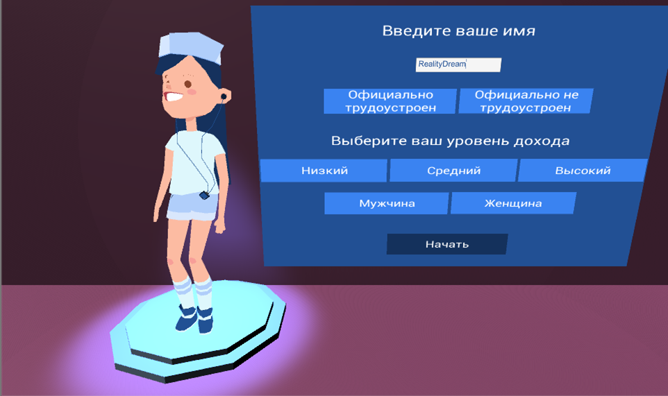
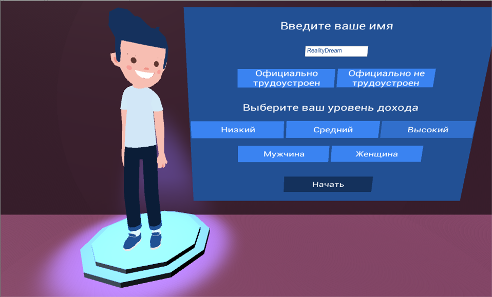
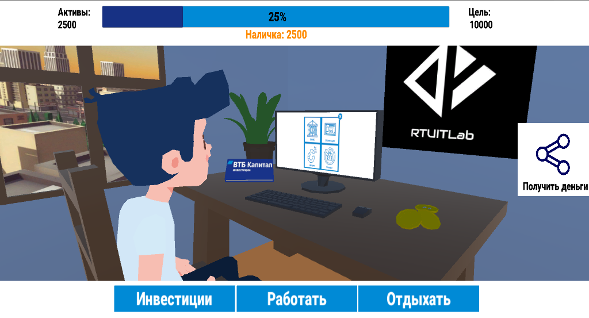
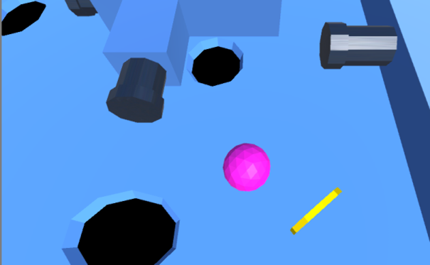
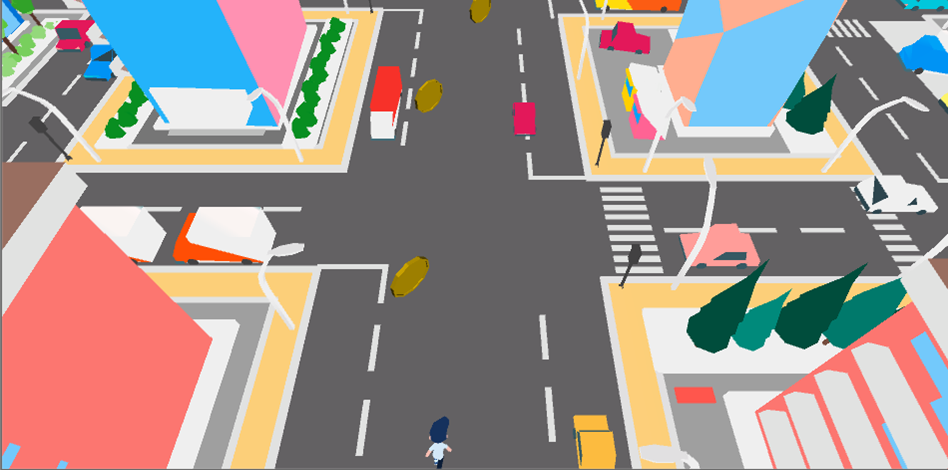
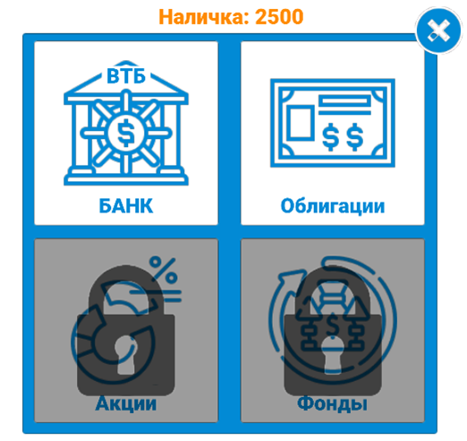
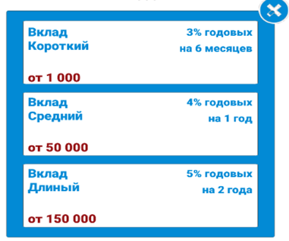
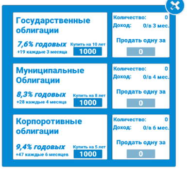
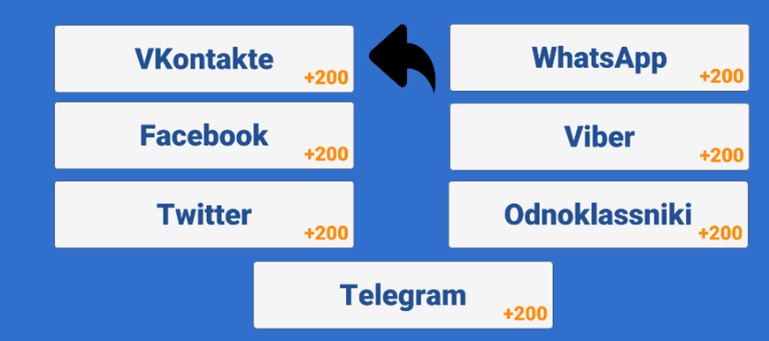

# VTBMobail

Приложение представляет собой мобильный финансовый наставник ВТБ. Позволяет проводить обучение инвестициям в игровой форме.

---

# Images

Стартовый экран предлагает регистрацию пользователя и ввод личной информации, на основе которой в дальнейшем будет происходить сегментация. От выбора пола зависит пол персонажа в игре, который будет отображаться на главном экране, а так же в мини-играх. От выбора уровня дохода будет меняться поведение персонажа, он будет по-разному инвестировать в разные вещи, также это позволит собирать статистику до реального инвестирования. На основе собранных данных на этапе виртуального инвестирования можно находить зависимости, связанные с предпочтением к объектам инвестирования от уровня доходов, а так же предлагать более подходящий конкретному пользователю пакет акций 

Следующий экран представляет собой комнату, в которой персонаж переводит дух. Сверху показан прогресс по цели, представлен тремя цифрами. Цифра слева – все активы персонажа. Цифра посередине – средства, в распоряжении персонажа. Цифра справа – заветная цель. Цель – это сумма, которая необходима персонажу на реализацию своей мечты. Фактор, мотивирующий персонажа инвестировать – Инфляция, соответственно каждый игровой месяц цель становится дальше. Снизу кнопки управления – Инвестиции, Работать и Отдыхать , сверху слева кнопка Поделиться. 

Кнопка Работа позволяет выбрать одну из двух мини-игр, в которых главной целью является сбор монеток, они переводятся в деньги, на которые можно инвестировать.

Кнопка Инвестиции позволяет выбрать один из вариантов инвестирования. Кнопка «Поделиться» - позволяет отправлять приглашения в социальных сетях и мессенджерах. За использование кнопки в игре предусмотрена награда в виде игровой валюты.

---

# Tech
* C#
* 3D modeling
* Unity 3D

---

# Developers
* Баканова М.В.
* Новаков Н.Ю.
* Шутов К.И.
---

